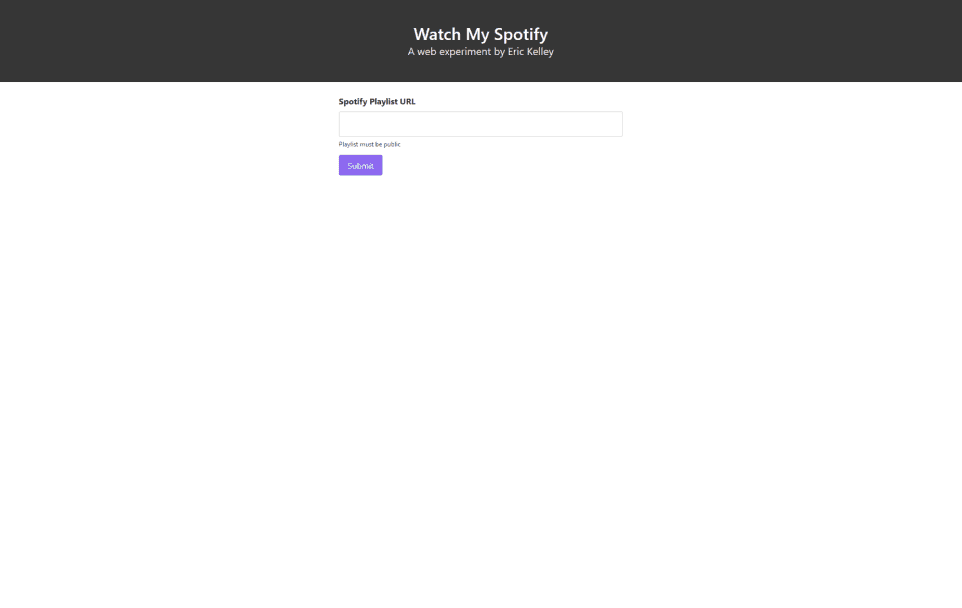

# Watch My Spotify

A simple app that converts your public spotify playlists to a YouTube playlist.

Built with Vue, Spotify API, Puppeteer, Netlify Functions and some good 'ole undocumented YouTube endpoints.

### Using the app
Enter a **Public** Spotify playlist URL in the input box and hit the big green button. Keep playlists 50 songs or less.

Why only 50? To be blunt, the YouTube Data API is expensive for an app like this so I use an undocumented endpoint that generates playlists from an array of IDs - and that is the bottleneck.

### Running Locally
Clone the repo and run `yarn` or `npm install` to install dependencies.

Before running the app, you'll need to [create a Spotify Developer app](https://developer.spotify.com/dashboard/login) and get the Client ID and Client Secret.

Next, you'll need to generate your [Spotify Refresh Token](https://getyourspotifyrefreshtoken.herokuapp.com/). Check out the [Spotify Authorization Guide](https://developer.spotify.com/documentation/general/guides/authorization-guide/) for more info on that stuff.

Tuck all those goodies into an `.env` file. You should have three variables:

`SPOTIFY_CLIENT_ID`, `SPOTIFY_CLIENT_SECRET`, and `SPOTIFY_REFRESH_TOKEN`.

At this point you're pretty much all set. This app uses Netlify Functions to handle the server side stuff so make sure you have `netlify-cli` installed on your machine. Feel free to move your environment variables over to Netlify once you deploy - they'll inject automatically when Netlify CLI is run if you're logged in and have linked the repo to a Netlify deploy.

Finally, run `yarn dev` to launch Netlify CLI and host the app.